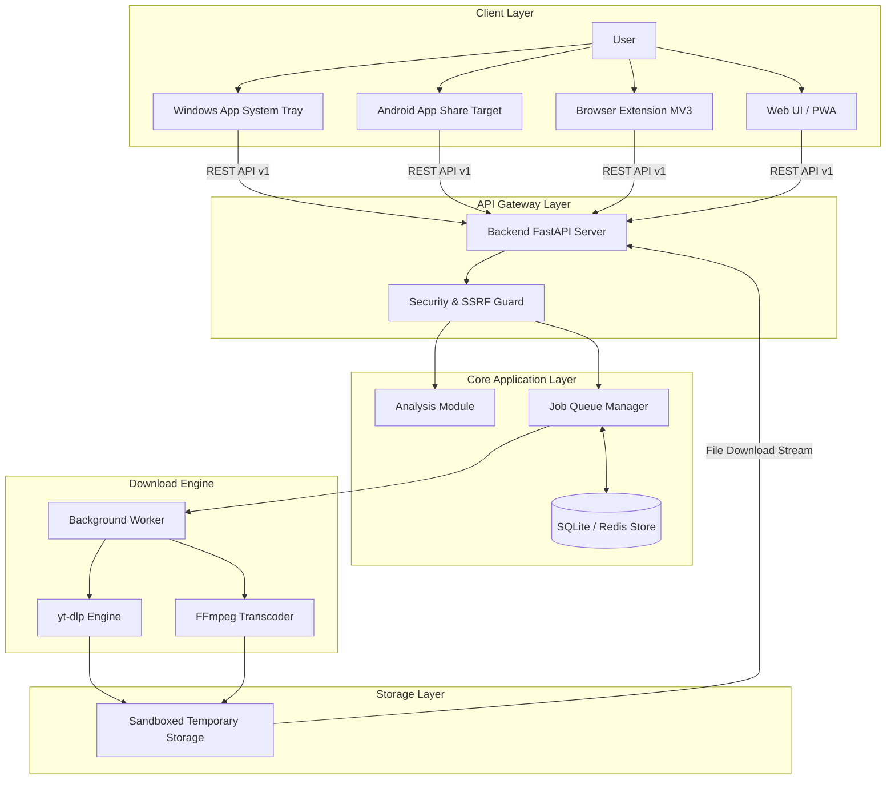
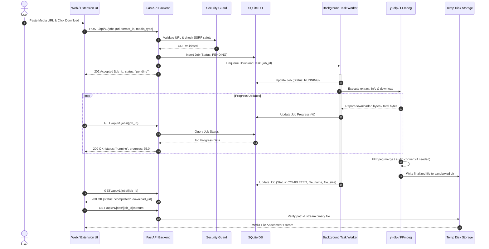

# 🏗️ ENTERPRISE ARCHITECTURE SPECIFICATION: ABIRs Downloader

> **Document Version:** 1.0.0  
> **Status:** ARCHITECTURAL FREEZE (IMMUTABLE REFERENCE)  
> **Governing Document:** [PROJECT_CONSTITUTION.md](file:///C:/Users/Abir/Downloader/PROJECT_CONSTITUTION.md)  
> **Author:** Chief Software Architect  

---

## 1. Executive Overview

### 1.1 Overall Architecture
ABIRs Downloader is designed as a **decoupled, event-driven, hybrid local/cloud media extraction platform**. It separates client presentation layers (Windows System Tray App, Android Native WebView Wrapper, Browser Extension MV3, and Web PWA) from backend business logic and transcoding engines.

The backend operates as an asynchronous, API-first service powered by **FastAPI**, **yt-dlp**, and **FFmpeg**, utilizing **SQLite (WAL mode)** for local persistence and **Redis / RQ** for cloud background task queues.

```
+-----------------------------------------------------------------------------------+
|                                  CLIENT LAYER                                     |
|  [Windows Tray App]    [Android WebView App]    [Browser Extension]    [Web PWA]  |
+-----------------------------------------------------------------------------------+
                                          |
                                HTTP / REST API (v1)
                                          v
+-----------------------------------------------------------------------------------+
|                                  BACKEND LAYER                                    |
|                   [FastAPI Gateway] <---> [Security & SSRF Guard]                 |
|                                         |                                         |
|                 [SQLite / Database] <---+---> [Task Queue Worker]                 |
+-----------------------------------------------------------------------------------+
                                          |
                                          v
+-----------------------------------------------------------------------------------+
|                              EXECUTION & STORAGE                                  |
|         [yt-dlp Extractor Engine] <---> [FFmpeg Stream Merger / Converter]        |
|                                         |                                         |
|                                         v                                         |
|                             [Sandboxed Media Storage]                             |
+-----------------------------------------------------------------------------------+
```

### 1.2 System Goals
1. **Platform Independence:** Universal accessibility via Web UI, System Tray Desktop Daemon, Browser Extensions, and Mobile Share Target intents.
2. **Asynchronous Non-Blocking Execution:** Zero request thread blocking; long-running downloads operate as background jobs with real-time status tracking.
3. **High Security & SSRF Immunity:** Full sanitization of user-provided URLs and filenames, guarding against remote code execution, path traversal, and internal network scanning.
4. **Deterministic Single Source of Truth:** Elimination of redundant scripts and duplicate Android/Desktop implementations.

### 1.3 Platform Relationships
- **Web PWA:** Acts as the universal UI base. Served directly by the backend in both local and cloud modes.
- **Android App:** Native wrapper hosting the Web PWA inside a secure WebView, intercepting `android.intent.action.SEND` intents from third-party social media apps.
- **Browser Extension:** MV3 lightweight popup communicating with local or remote backend APIs to extract active tab URLs.
- **Windows App:** System tray daemon managing backend process lifecycle, auto-boot registry settings, and desktop notifications.

---

## 2. High-Level Architecture

### 2.1 System Architecture Diagram



### 2.2 Component Descriptions
- **Client Layer:** Renders presentation interfaces, captures media URLs, dispatches extraction requests, and displays download progress.
- **API Gateway Layer:** Standardizes authentication, rate limiting, request validation, CORS checks, and endpoint routing.
- **Core Application Layer:** Handles domain logic, resolves platform metadata (YouTube, Spotify, Facebook), manages job states in the database, and schedules workers.
- **Download Engine:** Spawns asynchronous `yt-dlp` processes, executes audio extraction, merges multi-resolution video/audio streams via FFmpeg, and cleans up artifacts.
- **Storage Layer:** Manages temporary sandboxed media outputs, applies TTL file rotation, and persists job metadata in SQLite/PostgreSQL.

---

## 3. Module Breakdown

### 3.1 Backend Module (`backend/`)
- **Purpose:** Core business engine providing media extraction, transcode orchestration, job queueing, and file delivery APIs.
- **Responsibilities:** Process API requests, validate URLs against SSRF policies, execute `yt-dlp`, manage background tasks, clean up temp files.
- **Dependencies:** Python 3.11+, FastAPI, Pydantic, Uvicorn, yt-dlp, FFmpeg, SQLite, Redis/RQ (optional cloud).
- **Public Interfaces:** `/api/v1/health`, `/api/v1/analyze`, `/api/v1/jobs`, `/api/v1/jobs/{job_id}`, `/api/v1/jobs/{job_id}/stream`.
- **Internal Components:** `config.py`, `security.py`, `extractor.py`, `downloader.py`, `spotify.py`, `database.py`.

### 3.2 Desktop Module (`desktop/`)
- **Purpose:** System tray daemon and auto-start manager for Windows 10/11.
- **Responsibilities:** Host background engine on port 9191, manage system tray icon & menu, automate registry startup, launch default browser UI.
- **Dependencies:** Python 3.11+, PyInstaller, `pystray`, `Pillow`, `winreg` (Windows native).
- **Public Interfaces:** Native OS System Tray Context Menu (Open UI, Toggle Auto-Start, Server Logs, Exit).
- **Internal Components:** `app.py`, `installer.bat`, `build.py`, `assets/tray_icon.ico`.

### 3.3 Android Module (`android/`)
- **Purpose:** Native Android app wrapper providing native Share Target integration.
- **Responsibilities:** Intercept shared links (`android.intent.action.SEND`), pass shared URLs into bundled WebView UI via URL parameters, manage backend URL configuration.
- **Dependencies:** Android SDK (API 26+), Java/Kotlin, Gradle, AndroidX WebKit.
- **Public Interfaces:** Android OS Share Sheet Intent Filter (`text/plain`).
- **Internal Components:** `MainActivity.java`, `AndroidManifest.xml`, `build.gradle`, `res/`.

### 3.4 Extension Module (`extension/`)
- **Purpose:** Browser extension for Chrome, Edge, and Brave (Manifest V3).
- **Responsibilities:** Extract active tab URL, fetch format options from backend API, trigger background downloads, configure server endpoint.
- **Dependencies:** Chrome Extension MV3 APIs (`chrome.tabs`, `chrome.storage`, `chrome.runtime`).
- **Public Interfaces:** Browser Action Popup UI (`popup.html`), Extension Options Page (`options.html`).
- **Internal Components:** `manifest.json`, `popup.js`, `options.js`, `assets/icon-*.png`.

### 3.5 Web UI Module (`web/`)
- **Purpose:** Universal glassmorphism frontend user interface.
- **Responsibilities:** Display input bar, format cards, download progress bars, client-side history, server settings modal.
- **Dependencies:** HTML5, CSS3, Vanilla ES6 JavaScript, PWA Service Worker (`sw.js`), Web Manifest (`manifest.json`).
- **Public Interfaces:** User browser interface accessible via `http://127.0.0.1:9191` or cloud host.
- **Internal Components:** `index.html`, `styles.css`, `app.js`, `manifest.json`, `sw.js`.

### 3.6 Shared Module (`shared/`)
- **Purpose:** Cross-cutting assets, API schema contracts, and environment documentation.
- **Responsibilities:** Maintain unified design tokens, API specifications, and shared asset branding.
- **Dependencies:** None.
- **Public Interfaces:** OpenAPI spec schemas, CSS design tokens.
- **Internal Components:** `docs/API_SPEC.md`, shared visual assets.

---

## 4. Backend Architecture

```
+------------------------------------------------------------------+
|                        PRESENTATION LAYER                        |
|                  Static PWA Server (index.html, sw.js)           |
+------------------------------------------------------------------+
                                  |
                                  v
+------------------------------------------------------------------+
|                            API LAYER                             |
|          FastAPI Routers (/api/v1/analyze, /api/v1/jobs)        |
+------------------------------------------------------------------+
                                  |
                   +--------------+--------------+
                   |                             |
                   v                             v
+------------------------------------+ +---------------------------+
|           SECURITY LAYER           | |      SERVICES LAYER       |
|  SSRF Guard & Input Sanitization   | | Extractor, Spotify Match |
+------------------------------------+ +---------------------------+
                   |                             |
                   +--------------+--------------+
                                  |
                                  v
+------------------------------------------------------------------+
|                        BACKGROUND WORKER                         |
|             Asyncio Task Queue / RQ Redis Worker                 |
+------------------------------------------------------------------+
                                  |
                 +----------------+----------------+
                 |                                 |
                 v                                 v
+----------------------------------+ +-----------------------------+
|         DOWNLOAD ENGINE          | |        STORAGE LAYER        |
|  yt-dlp Runner & FFmpeg Merger   | | SQLite DB & Temp Disk Store |
+----------------------------------+ +-----------------------------+
```

---

## 5. API Architecture

### 5.1 Health Check Endpoint
- **Method:** `GET`
- **URL:** `/api/v1/health`
- **Purpose:** Monitor service status, version, and dependency availability.
- **Request Schema:** None
- **Response Schema:**
```json
{
  "success": true,
  "data": {
    "status": "healthy",
    "version": "3.0.0",
    "ffmpeg_available": true,
    "mode": "local"
  },
  "error": null,
  "timestamp": "2026-08-05T11:14:00Z"
}
```
- **Auth / Validation:** None
- **Status Codes:** `200 OK`

### 5.2 Analyze Media Endpoint
- **Method:** `POST`
- **URL:** `/api/v1/analyze`
- **Purpose:** Extract media title, thumbnail, duration, and supported formats.
- **Request Schema:**
```json
{
  "url": "https://www.youtube.com/watch?v=dQw4w9WgXcQ"
}
```
- **Response Schema:**
```json
{
  "success": true,
  "data": {
    "title": "Rick Astley - Never Gonna Give You Up",
    "thumbnail": "https://i.ytimg.com/vi/dQw4w9WgXcQ/maxresdefault.jpg",
    "uploader": "Rick Astley",
    "duration": "03:33",
    "formats": [
      {
        "format_id": "mp3_best",
        "ext": "mp3",
        "label": "🎵 MP3 Audio (320 kbps)",
        "type": "audio"
      },
      {
        "format_id": "1080",
        "ext": "mp4",
        "label": "🎬 1080p HD Video (MP4)",
        "type": "video"
      }
    ]
  },
  "error": null,
  "timestamp": "2026-08-05T11:14:00Z"
}
```
- **Auth / Validation:** SSRF URL validation, domain whitelist check, rate limit (30 req/min).
- **Status Codes:** `200 OK`, `400 Bad Request` (Invalid URL), `429 Too Many Requests`.

### 5.3 Create Download Job Endpoint
- **Method:** `POST`
- **URL:** `/api/v1/jobs`
- **Purpose:** Enqueue background download task.
- **Request Schema:**
```json
{
  "url": "https://www.youtube.com/watch?v=dQw4w9WgXcQ",
  "format_id": "1080",
  "media_type": "video"
}
```
- **Response Schema:**
```json
{
  "success": true,
  "data": {
    "job_id": "job_a1b2c3d4",
    "status": "pending",
    "progress": 0.0,
    "created_at": "2026-08-05T11:14:00Z"
  },
  "error": null,
  "timestamp": "2026-08-05T11:14:00Z"
}
```
- **Auth / Validation:** URL validation, format validation, rate limit (10 req/min).
- **Status Codes:** `202 Accepted`, `400 Bad Request`, `429 Too Many Requests`.

### 5.4 Get Job Status Endpoint
- **Method:** `GET`
- **URL:** `/api/v1/jobs/{job_id}`
- **Purpose:** Poll background download status and progress percentage.
- **Request Schema:** None
- **Response Schema:**
```json
{
  "success": true,
  "data": {
    "job_id": "job_a1b2c3d4",
    "status": "completed",
    "progress": 100.0,
    "file_name": "Rick_Astley_Never_Gonna_Give_You_Up.mp4",
    "file_size": 24510920,
    "download_url": "/api/v1/jobs/job_a1b2c3d4/stream"
  },
  "error": null,
  "timestamp": "2026-08-05T11:14:05Z"
}
```
- **Auth / Validation:** `job_id` string pattern validation.
- **Status Codes:** `200 OK`, `404 Not Found`.

### 5.5 Stream Downloaded File Endpoint
- **Method:** `GET`
- **URL:** `/api/v1/jobs/{job_id}/stream`
- **Purpose:** Stream binary media file attachment to user client.
- **Request Schema:** None
- **Response Headers:** `Content-Type: video/mp4`, `Content-Disposition: attachment; filename="Sanitized_Title.mp4"`.
- **Auth / Validation:** Verify job exists, status is `completed`, file exists on disk within sandboxed path.
- **Status Codes:** `200 OK`, `404 Not Found`, `410 Gone` (File expired/cleaned).

---

## 6. Download Pipeline

### 6.1 Pipeline Sequence Diagram



### 6.2 Pipeline Stages Detailed Specification
1. **URL Submission:** Client captures user input, removes leading/trailing whitespace.
2. **Validation Stage:** SSRF filter validates URL protocol, checks domain syntax, resolves DNS to verify non-private IP space.
3. **Metadata Extraction:** `yt-dlp` extracts format options without downloading full binary content.
4. **Queue Stage:** Task job record created in DB with UUID identifier, state set to `PENDING`, task dispatched to worker queue.
5. **Download Execution:** Worker executes `yt-dlp` download with specific format strings (`bestvideo+bestaudio` or `bestaudio`).
6. **Merge & Transcode Stage:** FFmpeg merges video and audio tracks or extracts 320kbps MP3 audio stream.
7. **Storage & Sanitization:** Output file written to `downloads/` directory with a safe sanitized filename (`safe_name()`).
8. **Completion & Stream:** Job marked `COMPLETED` in DB, client receives attachment download link.
9. **Automated Cleanup:** Ephemeral files older than `MAX_FILE_AGE` (default 600s) deleted via deterministic background timer.

---

## 7. Desktop Architecture

```
+-------------------------------------------------------------+
|                 WINDOWS OS ENVIRONMENT                      |
|                                                             |
|  [HKCU Run Registry] ----> Spawns ----> [desktop/app.py]    |
+-------------------------------------------------------------+
                                                  |
                                                  v
+-------------------------------------------------------------+
|                WINDOWS TRAY APPLICATION                     |
|                                                             |
|   +-------------------+             +-------------------+   |
|   |  System Tray Menu |             | Local HTTP Server |   |
|   | (Pystray / Icon)  |             | (FastAPI Port 9191)|   |
|   +-------------------+             +-------------------+   |
|             |                                 |             |
+-------------|---------------------------------|-------------+
              |                                 |
              v                                 v
   [User Browser UI] <------------ [API Endpoint http://127.0.0.1:9191]
```

- **System Tray:** Daemon renders system tray icon (`pystray`). Context menu allows opening Web UI, toggling boot auto-start, viewing logs, or stopping the application.
- **Auto Start:** Toggle adds/removes Windows Registry Key: `HKCU\Software\Microsoft\Windows\CurrentVersion\Run\ABIRsDownloader`.
- **Backend Detection:** Checks if port 9191 is bound; if bound by another instance, notifies user and avoids duplicate binding.

---

## 8. Android Architecture

```
+-------------------------------------------------------------+
|                  ANDROID OS ENVIRONMENT                     |
|                                                             |
|  Third-Party Apps (YouTube / Instagram / Facebook)           |
|                         |                                   |
|               User clicks "Share Link"                      |
|                         v                                   |
|       [android.intent.action.SEND Intent Filter]             |
+-------------------------------------------------------------+
                              |
                              v
+-------------------------------------------------------------+
|                 NATIVE ANDROID APP                          |
|                                                             |
|   +-----------------------------------------------------+   |
|   | MainActivity.java                                   |   |
|   | - Extract Intent URL parameter                      |   |
|   | - Load Web UI into Android WebView                  |   |
|   | - Pass target URL via parameter:                    |   |
|   |   http://[Backend_Host]:9191/?url=[Shared_URL]       |   |
|   +-----------------------------------------------------+   |
|                             |                               |
|                             v                               |
|   +-----------------------------------------------------+   |
|   | Android WebView Container                           |   |
|   | - Hardware Accelerated Rendering                    |   |
|   | - WebChromeClient Download Manager Delegate         |   |
|   +-----------------------------------------------------+   |
+-------------------------------------------------------------+
```

- **Share Target:** Intercepts plain text URLs shared from external apps, parses URL parameter, and auto-populates main download input field inside WebView.

---

## 9. Browser Extension Architecture

```
+-----------------------------------------------------------------+
|                     BROWSER EXTENSION (MV3)                     |
|                                                                 |
|  +---------------------+             +-----------------------+  |
|  | Popup UI            |             | Options UI            |  |
|  | (popup.html/.js)    |             | (options.html/.js)    |  |
|  +---------------------+             +-----------------------+  |
|             |                                     |             |
|             +------------------+------------------+             |
|                                |                                |
|                                v                                |
|             +--------------------------------------+            |
|             | Chrome Extension Storage API         |            |
|             | (target_backend_url setting)         |            |
|             +--------------------------------------+            |
|                                |                                |
|                                v                                |
|             +--------------------------------------+            |
|             | Background Service Worker            |            |
|             | (chrome.tabs active URL query)       |            |
|             +--------------------------------------+            |
+-----------------------------------------------------------------+
                                 |
                          HTTP REST Calls
                                 v
               [Local or Remote FastAPI Backend]
```

- **Active Tab Query:** Queries active Chrome/Edge tab URL upon opening popup, automatically initiating media format analysis against configured backend server endpoint.

---

## 10. Web UI Architecture

- **Glassmorphism Design System:** Built with native CSS grid/flexbox, standard CSS variables for dark theme tokens (`#0f172a`, `#6366f1`), backdrop filters, and Lucide SVG icons.
- **State Management:** Reactive vanilla JS state store managing active URL, extracted formats, download progress polling interval, and local history array.

---

## 11. Configuration System

### 11.1 Configuration Hierarchy (Order of Precedence)
1. Environment Variables (Highest priority)
2. `.env` file in execution root
3. `config.json` configuration file
4. Built-in Application Defaults (Lowest priority)

### 11.2 Configuration Parameters (`backend/app/config.py`)

| Parameter | Type | Default Value | Description |
| :--- | :--- | :--- | :--- |
| `APP_MODE` | String | `"local"` | Execution mode: `"local"` or `"cloud"`. |
| `HOST` | String | `"127.0.0.1"` | Bind host address. |
| `PORT` | Integer | `9191` | Bind HTTP port. |
| `DOWNLOAD_DIR` | Path | `"./downloads"` | Path to sandboxed temporary media store. |
| `MAX_FILE_AGE` | Integer | `600` | Expiration time for temporary files (seconds). |
| `REDIS_URL` | String | `""` | Redis connection string for cloud task queue. |
| `API_KEY` | String | `""` | Require API key header if set in cloud mode. |
| `ALLOWED_ORIGINS`| List | `["*"]` (local) | CORS allowed origin domains list. |

---

## 12. Storage Design

### 12.1 Database ER Diagram Specification (SQLite / PostgreSQL)

#### Table: `download_jobs`
- `id` (VARCHAR(36), Primary Key) — UUID job identifier.
- `url` (TEXT, Not Null) — Validated media source URL.
- `format_id` (VARCHAR(32), Not Null) — Selected format string.
- `media_type` (VARCHAR(16), Not Null) — `"video"` or `"audio"`.
- `status` (VARCHAR(16), Not Null) — `"pending"`, `"running"`, `"completed"`, `"failed"`, `"cancelled"`.
- `progress` (FLOAT, Default 0.0) — Download percentage (0.0 to 100.0).
- `file_name` (VARCHAR(255), Nullable) — Sanitized output filename on disk.
- `file_size` (BIGINT, Nullable) — File size in bytes.
- `error_message` (TEXT, Nullable) — Error string if job failed.
- `created_at` (TIMESTAMP, Default UTC NOW) — Creation timestamp.
- `updated_at` (TIMESTAMP, Default UTC NOW) — Last state change timestamp.

#### Table: `app_settings`
- `key` (VARCHAR(64), Primary Key) — Settings key name.
- `value` (TEXT, Not Null) — JSON serialized configuration value.
- `updated_at` (TIMESTAMP, Default UTC NOW) — Last update timestamp.

#### Database Indexes
- `idx_jobs_status_created` ON `download_jobs(status, created_at)`
- `idx_jobs_created_at` ON `download_jobs(created_at)`

---

## 13. Background Job Design

```
+--------------------------------------------------------------------+
|                         JOB STATE LIFECYCLE                        |
|                                                                    |
|    +---------+       +---------+       +-----------+               |
|    | PENDING | ----> | RUNNING | ----> | COMPLETED |               |
|    +---------+       +---------+       +-----------+               |
|                         |                                          |
|                         +-------------> +--------+                 |
|                         |               | FAILED |                 |
|                         |               +--------+                 |
|                         |                    |                     |
|                         v                    v                     |
|                   +-----------+       +------------+               |
|                   | CANCELLED |       | RETRY (x3) |               |
|                   +-----------+       +------------+               |
+--------------------------------------------------------------------+
```

---

## 14. Error Handling Strategy

| Error Category | HTTP Code | Internal Error Code | Recovery Action |
| :--- | :--- | :--- | :--- |
| **Invalid URL** | `400` | `ERR_INVALID_URL` | Prompt user to verify media link syntax. |
| **SSRF Violation** | `403` | `ERR_SSRF_BLOCKED` | Reject request immediately and log security event. |
| **Extraction Failed** | `400` | `ERR_EXTRACTION_FAILED` | Check `yt-dlp` updates; report private/deleted media. |
| **FFmpeg Missing** | `500` | `ERR_FFMPEG_MISSING` | Notify admin to install FFmpeg binary on server host. |
| **Disk Space Low** | `507` | `ERR_DISK_FULL` | Trigger immediate cleanup of old temporary files. |
| **Timeout Exceeded** | `504` | `ERR_JOB_TIMEOUT` | Mark job as failed and offer retry option to client. |

---

## 15. Logging Strategy

- **Application Logs:** Output structured JSON to stdout and log files (`backend/logs/app.log`).
- **Rotation:** Rotate daily or when file size reaches 10 MB. Retain last 7 rotated log files.
- **Privacy:** Anonymize client IP addresses (hash with salt) and strip authorization headers before writing to log streams.

---

## 16. Security Architecture

- **SSRF Protection:** DNS resolution validation blocking RFC 1918 private ranges (`10.0.0.0/8`, `172.16.0.0/12`, `192.168.0.0/16`, `127.0.0.0/8`) and AWS metadata endpoints (`169.254.169.254`).
- **Filename Sanitization:** Strip control characters, quotes, and path separators; restrict filename lengths to 60 characters.
- **CORS Policies:** Restricted to localhost in local mode; explicitly configured domain white-list in cloud mode.

---

## 17. Performance Strategy

- **Asynchronous I/O:** Uvicorn ASGI server with FastAPI handles concurrent API calls without blocking.
- **Direct File Streaming:** Chunked HTTP response streaming (`FileResponse` / `StreamingResponse` 64KB chunk buffer) for file downloads to minimize server RAM footprint.
- **Static Pre-Compression:** Gzip compression applied to static Web PWA assets (`index.html`, `styles.css`, `app.js`).

---

## 18. Folder Structure Freeze

The repository MUST be organized into the following immutable folder layout:

```
Downloader/
├── .github/
│   └── workflows/
│       ├── ci.yml
│       └── release.yml
├── backend/
│   ├── app/
│   │   ├── __init__.py
│   │   ├── main.py
│   │   ├── config.py
│   │   ├── api/
│   │   │   └── v1/
│   │   │       ├── endpoints/
│   │   │       │   ├── analyze.py
│   │   │       │   ├── download.py
│   │   │       │   ├── health.py
│   │   │       │   └── history.py
│   │   │       └── api.py
│   │   ├── core/
│   │   │   ├── security.py
│   │   │   └── database.py
│   │   ├── services/
│   │   │   ├── extractor.py
│   │   │   ├── downloader.py
│   │   │   └── spotify.py
│   │   ├── models/
│   │   └── workers/
│   ├── tests/
│   │   ├── unit/
│   │   ├── integration/
│   │   └── conftest.py
│   ├── Dockerfile
│   ├── requirements.txt
│   └── requirements-dev.txt
├── desktop/
│   ├── app.py
│   ├── installer.bat
│   ├── build.py
│   └── assets/
├── extension/
│   ├── manifest.json
│   ├── popup.html
│   ├── popup.js
│   ├── options.html
│   ├── options.js
│   └── assets/
├── android/
│   ├── app/
│   │   ├── src/
│   │   │   └── main/
│   │   │       ├── java/com/abir/downloader/
│   │   │       │   └── MainActivity.java
│   │   │       ├── res/
│   │   │       └── AndroidManifest.xml
│   │   └── build.gradle
│   ├── build.gradle
│   └── settings.gradle
├── web/
│   ├── index.html
│   ├── styles.css
│   ├── app.js
│   ├── manifest.json
│   └── sw.js
├── docs/
│   ├── API_SPEC.md
│   └── DEPLOYMENT.md
├── PROJECT_CONSTITUTION.md
├── ENTERPRISE_ARCHITECTURE.md
├── README.md
├── render.yaml
└── .gitignore
```

---

## 19. Migration Plan

### 19.1 Action Tables for Repository Restructuring

#### KEEP (Unchanged Core Logic / Base Files)
- `README.md`
- `PROJECT_CONSTITUTION.md`
- `render.yaml`
- `.gitignore`

#### RENAME & MOVE (Relocating Existing Files to Target Single Source Structure)

| Original File Path | Target File Path | Rationale |
| :--- | :--- | :--- |
| `server.py` | `backend/app/main.py` (Refactored to FastAPI) | Standardize backend structure under single `backend/` module. |
| `windows_app/app.py` | `desktop/app.py` | Consolidate desktop launcher into clean target folder. |
| `windows_app/install_extension.bat` | `desktop/installer.bat` | Relocate desktop utility script into `desktop/`. |
| `build_windows_app.py` | `desktop/build.py` | Move PyInstaller build script into `desktop/`. |
| `index.html` | `web/index.html` | Establish dedicated single source web interface folder. |
| `manifest.json` (Web PWA) | `web/manifest.json` | Consolidate web PWA assets into `web/`. |
| `sw.js` | `web/sw.js` | Consolidate web service worker into `web/`. |
| `android_app/app/src/main/...` | `android/app/src/main/...` | Simplify top-level folder name from `android_app` to `android`. |
| `extension/*` | `extension/*` | Retain extension files in `extension/` module folder. |

#### DELETE (Removing Redundant, Duplicate, or Deprecated Artifacts)

| File Path to Delete | Rationale for Removal |
| :--- | :--- |
| `desktop_app.py` | Duplicate desktop script. `windows_app/app.py` (now `desktop/app.py`) is canonical. |
| `android_app/AndroidManifest.xml` | Duplicate manifest. The active manifest resides in `android/app/src/main/`. |
| `android_app/MainActivity.java` | Duplicate java source. The active source resides in `android/app/src/main/java/...`. |
| `android_app/web_app/` | Duplicate web files. The unified source of truth resides in `web/`. |
| `Start_Server.vbs` | Legacy background launcher; superseded by `desktop/app.py`. |
| `Stop_Server.vbs` | Legacy process script; superseded by system tray daemon controls. |
| `Procfile` | Redundant deployment spec; superseded by `Dockerfile` and `render.yaml`. |
| `ABIRs_Downloader.spec` | PyInstaller spec will be dynamically generated by `desktop/build.py`. |

#### CREATE (New Architectural Modules to be Created)

| Target Path to Create | Purpose |
| :--- | :--- |
| `backend/app/config.py` | Pydantic configuration and environment setting manager. |
| `backend/app/core/security.py` | SSRF protection, URL validation, and sanitization utilities. |
| `backend/app/core/database.py` | SQLite connection and SQLAlchemy model manager. |
| `backend/app/services/extractor.py` | Decoupled `yt-dlp` metadata extraction service. |
| `backend/app/services/downloader.py` | Asynchronous file download execution engine. |
| `backend/app/services/spotify.py` | Spotify metadata resolver and YouTube search matcher. |
| `backend/app/api/v1/endpoints/*.py` | Versioned REST API endpoint controllers. |
| `backend/tests/` | Unit and integration test suite. |
| `web/styles.css` | Extracted standalone CSS stylesheet for Web UI. |
| `web/app.js` | Extracted standalone JavaScript app logic for Web UI. |
| `.github/workflows/ci.yml` | Automated GitHub Actions CI pipeline. |

---

## 20. Development Order (Phased Implementation Roadmap)

All future development work MUST strictly follow this exact sequential 10-phase implementation order:

```
+--------------------------------------------------------------------------+
| PHASE 1: Repository Refactor (COMPLETED ✅)                              |
| - Created migration_backup/ and target directory hierarchy.              |
| - Copied source files into backend/, desktop/, android/, web/.           |
+--------------------------------------------------------------------------+
                                    |
                                    v
+--------------------------------------------------------------------------+
| PHASE 2: Flask Modularization                                            |
| - Refactor backend/ app into clean Flask Blueprints.                     |
| - Retain Flask framework stability (FastAPI avoided in v1).              |
| - Reference: root server.py (read-only). Target: backend/app/main.py.    |
+--------------------------------------------------------------------------+
                                    |
                                    v
+--------------------------------------------------------------------------+
| PHASE 3: Backend Cleanup & Modular Separation                            |
| - Split backend/ into security.py, sanitizer.py, formatter.py,          |
|   config.py, extractor.py, downloader.py, and spotify.py.                |
| - Implement SSRF guard, input validation, and safe filename logic.       |
+--------------------------------------------------------------------------+
                                    |
                                    v
+--------------------------------------------------------------------------+
| PHASE 4: SQLite Database Integration                                     |
| - Integrate SQLite persistence layer (download_jobs, app_settings).      |
| - Replace directory file scanning with indexed database job tracking.    |
+--------------------------------------------------------------------------+
                                    |
                                    v
+--------------------------------------------------------------------------+
| PHASE 5: Background Downloads (ThreadPoolExecutor)                       |
| - Decouple media format analysis from download execution.                |
| - Implement non-blocking ThreadPoolExecutor worker queue.               |
| - Add status polling and non-blocking download job execution.            |
+--------------------------------------------------------------------------+
                                    |
                                    v
+--------------------------------------------------------------------------+
| PHASE 6: Windows App Alignment                                           |
| - Refactor desktop/app.py system tray daemon to interact with backend.   |
| - Update PyInstaller build script and Windows Registry auto-start script.|
+--------------------------------------------------------------------------+
                                    |
                                    v
+--------------------------------------------------------------------------+
| PHASE 7: Extension Alignment                                             |
| - Refactor extension/ popup & options scripts for backend endpoints.     |
| - Implement server availability detection, badge feedback, & auto-detect.|
+--------------------------------------------------------------------------+
                                    |
                                    v
+--------------------------------------------------------------------------+
| PHASE 8: Android App Alignment                                           |
| - Clean android/ module source paths and Gradle build configurations.    |
| - Ensure native Share Target intent opens unified web/ UI cleanly.       |
+--------------------------------------------------------------------------+
                                    |
                                    v
+--------------------------------------------------------------------------+
| PHASE 9: Deployment & Packaging                                          |
| - Update Dockerfile to bundle static web/ PWA assets & FFmpeg binary.    |
| - Configure render.yaml cloud spec & setup GitHub Actions CI pipeline.   |
+--------------------------------------------------------------------------+
                                    |
                                    v
+--------------------------------------------------------------------------+
| PHASE 10: Automated Testing & CI Pipeline                                |
| - Write pytest suite covering security, analysis, and download API.      |
| - Validate full system integration and test coverage.                    |
+--------------------------------------------------------------------------+
```

---

> **ARCHITECTURAL FREEZE RATIFIED**  
> *This Enterprise Architecture Document is frozen and immutable. All future feature implementations and code edits must strictly align with the patterns, folder structures, and phased execution order defined herein.*
